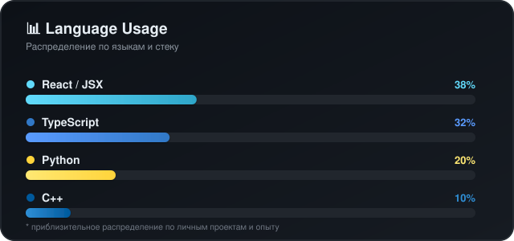

<h1>Hi, I'm Vyacheslav 👋 (Juryxa)</h1>

 

 

## 🧑‍💻 Обо мне / About me

<table>
<tr>
<td width="50%" valign="top">

**🇷🇺 Русский**

Full-stack разработчик с уверенным опытом создания веб-приложений «под ключ» — от проектирования архитектуры и API до деплоя и сопровождения в проде. Мой основной стек — **React**, **Next.js** и **TypeScript** на клиенте, **Node.js**, **NestJS** и **FastAPI** на сервере.

Проектирую REST и GraphQL API, реализую real-time взаимодействие через WebSocket, строю отказоустойчивые сервисы вокруг **PostgreSQL** и **Redis**. Настраиваю CI/CD, контейнеризирую и деплою через **Docker**, **Kubernetes** и **Nginx**, уверенно администрирую **Linux**-серверы.

Внимательно отношусь к архитектуре, читаемости и тестируемости кода, слежу за современными практиками системного дизайна и люблю разбирать сложные алгоритмические задачи.

- 🔭 Проектирую и разрабатываю full-stack приложения полного цикла
- 🧠 Погружаюсь в системный дизайн, паттерны и оптимизацию производительности
- ⚙️ Настраиваю CI/CD-пайплайны и облачную инфраструктуру
- ⚡ LeetCode — моя разминка перед рабочим днём

</td>
<td width="50%" valign="top">

**🇬🇧 English**

Full-stack developer with solid experience delivering end-to-end web applications — from architecture and API design to deployment and production support. My core stack is **React**, **Next.js** and **TypeScript** on the client side, and **Node.js**, **NestJS** and **FastAPI** on the server side.

I design REST and GraphQL APIs, build real-time features with WebSocket, and build resilient services around **PostgreSQL** and **Redis**. I set up CI/CD pipelines, containerize and deploy with **Docker**, **Kubernetes** and **Nginx**, and I'm comfortable administering **Linux** servers.

I care deeply about architecture, readability and testability of code, keep up with modern system design practices, and enjoy tackling non-trivial algorithmic problems.

- 🔭 Building full-cycle full-stack applications
- 🧠 Deep dive into system design, patterns & performance
- ⚙️ Setting up CI/CD pipelines and cloud infrastructure
- ⚡ LeetCode is my favorite warm-up before coding

</td>
</tr>
</table>

---

## 🌍 Языки / Languages

| Язык / Language | Уровень / Level |
|---|---|
| 🇷🇺 Русский | Родной / Native |
| 🇬🇧 English | B2 — Upper-Intermediate |

---

## 🛠️ Tech Stack

**Frontend**

**Backend**

**Базы данных / Databases**

**DevOps & Инструменты / Tools**

**Алгоритмы и структуры данных / Algorithms & Data Structures** 🧩

---

## 📊 Language Usage

---

## 📈 GitHub статистика / Stats

---

## 🧩 LeetCode

---

## 📫 Контакты / Contacts

---

⭐️ From [Juryxa](https://github.com/Juryxa)

