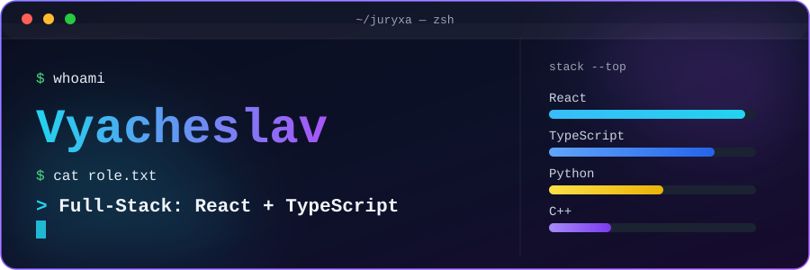

  

<h2>Hi, I'm Vyacheslav 👋 (Juryxa)</h2>

 

## 🧑‍💻 Обо мне / About me

<table>
<tr>
<td width="50%" valign="top">

**🇷🇺 Русский**

Пишу full-stack приложения — от API и бэкенда до интерфейса на React. Основной стек: **React**, **Next.js** и **TypeScript** на фронте, **Node.js**, **NestJS** и **FastAPI** на бэке.

Проектирую REST и GraphQL API, реализую real-time фичи через WebSocket, использую **PostgreSQL** и **Redis** для хранения и кэширования. Деплою через **Docker** и **Nginx**, работаю в **Linux**.

Люблю разбираться, как всё устроено внутри, читать чужой код и искать более простые решения. Иногда решаю задачи на LeetCode — просто потому что нравится.

- 🔭 Сейчас делаю full-stack pet-проекты и прокачиваю бэкенд-архитектуру
- 🧩 Люблю разбирать алгоритмические задачи
- 🛠️ Из инструментов — Docker, Nginx, Git

</td>
<td width="50%" valign="top">

**🇬🇧 English**

I build full-stack apps — from the API and backend to the interface in React. Core stack: **React**, **Next.js** and **TypeScript** on the frontend, **Node.js**, **NestJS** and **FastAPI** on the backend.

I design REST and GraphQL APIs, build real-time features with WebSocket, and use **PostgreSQL** and **Redis** for storage and caching. I deploy with **Docker** and **Nginx**, and work in **Linux**.

I like figuring out how things work under the hood, reading other people's code, and finding simpler solutions. Sometimes I solve LeetCode problems just because it's fun.

- 🔭 Working on full-stack side projects and backend architecture
- 🧩 Enjoy digging into algorithmic problems
- 🛠️ Tools I reach for — Docker, Nginx, Git

</td>
</tr>
</table>

---

## 🌍 Языки / Languages

| Язык / Language | Уровень / Level |
|---|---|
| 🇷🇺 Русский | Родной / Native |
| 🇬🇧 English | B2 — Upper-Intermediate |

---

## 🛠️ Tech Stack

**Frontend**

**Backend**

**Базы данных / Databases**

**Инструменты / Tools**

**Алгоритмы и структуры данных / Algorithms & Data Structures** 🧩

---

## 🧩 LeetCode

---

## 📫 Контакты / Contacts

---

⭐️ From [Juryxa](https://github.com/Juryxa)

